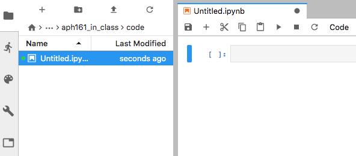
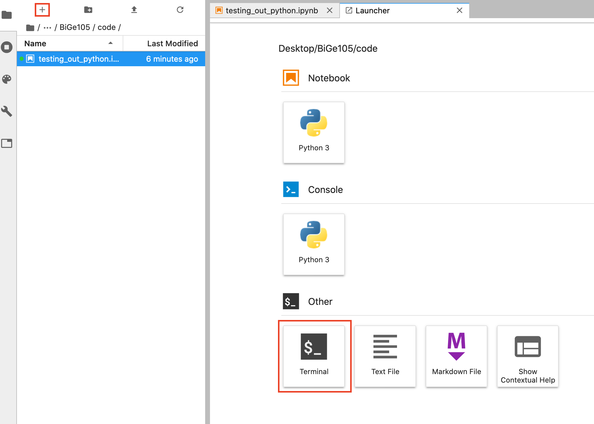
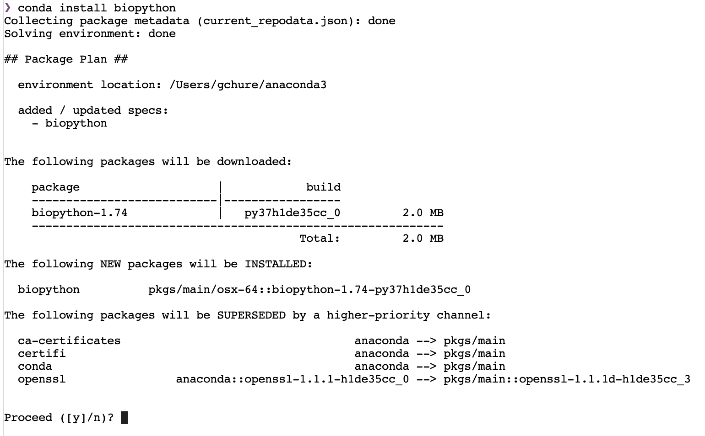

# Tutorial 0a: Setting Up Python For Scientific Computing

© 2020 Griffin Chure. This work is licensed under a [Creative Commons Attribution License CC-BY 4.0](https://creativecommons.org/licenses/by/4.0/). All code contained herein is licensed under an [MIT license](https://opensource.org/licenses/MIT) 

---

In this tutorial, we will set up a scientific Python computing environment using the [Anaconda python distribution by Continuum Analytics](https://www.continuum.io/downloads). 

##  Why Python?

As is true in human language, there are [hundreds of computer programming languages](https://en.wikipedia.org/wiki/List_of_programming_languages). While each has its own merit, the major languages for scientific computing are C, C++, R, MATLAB, Python, Java, Julia, and Fortran. [MATLAB](https://www.mathworks.com), [Julia](https://julialang.org/), and [Python](https://www.python.org) are similar in syntax and typically read as if they were written in plain english. This makes both languages a useful tool for teaching but they are also very powerful languages and are **very** actively used in real-life research. MATLAB is proprietary while Python is open source. A benefit of being open source is that anyone can write and release Python packages. For science, there are many wonderful community-driven packages such as [NumPy](http://www.numpy.org), [SciPy](http://www.scipy.org), [scikit-image](http://scikit-image.org), and [Pandas](http://pandas.pydata.org) just to name a few. 

##  Installing Python 3.7 with Anaconda

### Python 3.7 vs Python 2.7 

There are two dominant versions of Python (available through the Anaconda distribution) used for scientific computing, Python 2.7 and Python 3.7. We are at an interesting crossroads between these two versions. The most recent release (Python 3.7 as of December ) is not backwards compatible with previous versions of Python. While there are still some packages written for Python 2.7 that have not been modified for compatibility with Python 3.7, a large number have transitioned and Python 2.7 will no longer be supported as of January 1, 2020. As this will be the future for scientific computing with Python, we will use Python 3.7 for these tutorials.

<div class='alert alert-warning'> Note that Python 3.8 was officially released on October 14, 2019 but is not yet released via Anaconda. For the purposes of this course, we will use Python 3.7, which is the latest stable build available through Anaconda.  </div>

### Anaconda

There are several scientific Python distributions available for MacOS, Windows, and Linux. The two most popular, [Enthought Canopy](https://www.enthought.com/products/canopy/) and [Anaconda](https://www.continuum.io/why-anaconda) are specifically designed for scientific computing and data science work. For this course, we will use the Anaconda Python 3.7 distribution. To install the correct version, follow the instructions below.

1. Navigate to [the Anaconda download page](https://www.continuum.io/downloads) and download the Python 3.7 graphical installer.

2. Launch the installer and follow the onscreen instructions.


Congratulations! You now have the beginnings of a scientific Python distribution.

### Using JupyterLab as a Scientific Development Environment

Packaged with the Anaconda Python distribution is the [Jupyter project](https://jupyter.org/). This environment is incredibly useful for interactive programming and development and is widely used across scientific computing. Jupyter allows for interactive programming in a large array of programming languages including Julia, R, and MATLAB. As you've guessed by this point, we will be focusing on using Python through the Jupyter Environment. 

The key component of the Jupyter interactive programming environment is the [Jupyter Notebook](https://jupyter.org/). This acts lkike an interactive script which allows one to interweave code, mathematics, and text to create a complete narrative around your computational project. In fact, you are reading a Jupyter Notebook right now!

While Jupyter Notebooks are fantastic alone, we will be using them throughout the course via the [JupyterLab Integrated Development Environment (IDE)](https://jupyter.org/). JupyterLab allows omne to write code in notebooks, navigate around your file system, write isolated python scripts, and even access a UNIX terminal, all of which we  will do throughout this class. Even better, JupyterLab comes prepackaged with your Anaconda Python distribution.

### Launching JupyterLab

When you installed Anaconda, you also installed the Anaconda Navigator, an app that allows you to easily launch a JupyterLab instance. When you open up Anaconda Navigator, you should see a screen that looks like this,


where I have boxed in the JupyterLab prompt with a red box. Launch the JupyterLab IDE by clicking the 'launch' button. This should automatically open a browser window with the JupyterLab interface, 


### Creating your course directory

During the course, you will be handing in the computational portions of your homeworks as Jupyter Notebooks and, as such, it will be important for the TA's to be able to run your code to grade it. We will often be reading in data from a file on your computer, manipulating it, and then plotting the outcome. **To ensure the TA's can run your code without manipulating it, you MUST use a specific file structure.** We can set up the file structure pretty easily directly through JupyterLab. 

Open the side bar of the JupyterLab interface by clicking the folder icon on the left hand side of the screen. This will slide open a file browser like so:
<center>

</center>

Your files will look different than mine (unless you're using my computer!), but it will show the contents of your computer's `home` directory. 

Using the sidebar, navigate to wherever you will want to make a new folder called `BiGe105` by clicking the "new folder" symbol, .

Double-click the `BiGe105` folder to open it and make two new folders, one named `code` and another `data`. Your final file directory should look like so (note that I made my `BiGe105` folder on my Desktop):

<center>

</center>

That's it! You've now made the file structure for the class. 

All of the Jupyter Notebooks you use in the course will be made and wirttin in the `code` folder. All data you have to load will live in the `data` directory. This structure will make things easier for the TA when it comes to grading your work, but will also help you maintain a tidy homework folder.

### Starting A Jupyter Notebook

Let's open a new notebook. Navigate to your `code` folder and click the `+` in the sidebar. This will open a new "Launcher" window where a variety of new filetypes can be opened. One of them will be a "Python 3 Notebook".

<center>

</center>

Clicking this will open a new Jupyter Nook named `Untitled.ipynb`.

<center>

</center>

Right-click the "Untitled.ipynb" in the sidebar and rename it to something more informative, say `testing_out_python.ipynb`.

The right-ha d side of your screen is the actual notebook. You will see a "code cell" (grey rectangle) along with a bunch of other boxes above it. In the [Jupyter Notebook Tutorial](http://rpgroup.caltech.edu/bige105/tutorials/t0b/t0b_jupyter_notebooks) we cover these buttons in detail. For now, we'll just check to make sure you have a working Python distribution. 


## `Hello, Pangaea`

Let's write our first bit of Python code to make sure that everything is working correctly on your system. In Jupyter Notebooks, all code is typed in grey rectangles called "code cells". When a cell is "run", the result of the computation is shown underneath the code cell. Double-click the code cell on the right-hand side of your JupyterLab window and type the following:


```python
# This a comment and won't be read by Python. All comments start with `#`
print('Hello, Pangaea. Long time, no see. This sentence should be printed below by pressing `Shift + Enter` ')
```

    Hello, Pangaea. Long time, no see. This sentence should be printed below by pressing `Shift + Enter` 


Note that you cannot edit the text *below* the code cell. This is the output of the `print()` function in Python.

### Our First Plot
This class will often require you to generate plots of your computations coupled with some comments about your interpretation. Let's try to generate a simple plot here to make sure everything is working with your distribution. Don't worry too much about the syntax for right now. The basics of Python syntax are given in [Tutorial 0c](http://rpgroup.caltech.edu/bige105/tutorials/t0b/t0c_python_syntax_and_plotting).

Add a new code cell beneath the one that contains `print('Hello, Pangaea')`. When you execute a cell using `Shift + Enter`, a new cell should appear beneath what you just ran. If it's not there, you can make a new cell by clicking the `+` icon in the notebook menu bar. In the new cell, type the following:


```python
# Import Python packages necessary for this script
import numpy as np
import matplotlib.pyplot as plt
import seaborn as sns
sns.set()

# Generate a beautiful sinusoidal curve
x = np.linspace(0, 2*np.pi, 500)
y = np.sin(2 * np.sin(2 * np.sin(2 * x)))
plt.plot(x, y)
plt.xlabel('$x$')
plt.ylabel('$y$')
plt.show()
```


If you can see this plot in your notebook, then congratulations! You have a working Python 3.7 distribution. 

### Installing extra packages using Conda 

With the Anaconda Python distribution, you can install verified packages (scientific and non-scientific) through the [Conda](http://conda.pydata.org/docs/) package manager. **Note that you do not have to download Conda separately. This comes packaged with Anaconda**. To install packages through Conda, we must manually enter their names on the command line. 

One of your first computational homeworks will involve doing some rudimentary bioinformatics to compare sequences of the  `ENAM` gene among cetaceans. To do so, we will use the [BioPython](http://biopython.org) package which does not come prepackaged along with Anaconda. Let's install it using the command line that is built in with Jupyter Lab. 

On the sidebar menu, open a new Launcher window by clicking the `+` button (just like we did to make a new Jupyter Notebook). Now, instead of opening a notebook, choose the "Terminal" selection at the bottom.

<center>

</center>

This will open a new tab on the right-hand side of your screen and will launch a shell environment (yours may look different than mine). Click on the command line, type

```
conda install biopython
```

and hit enter. After a few seconds (or a minute, depending on your internet connection), you should be greeted with the following screen:

<center>

</center>

Note that at the bottom it asks for your permission to install teh package and update its dependencies, if necessary. Type `y` and then hit enter. Biopython will then be installed. 
